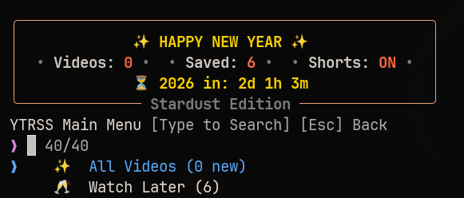

# YTRSS 2.0 📺

**The minimalist, distraction-free YouTube RSS client for your terminal.**

YTRSS 2.0 allows you to browse, organize, and watch your YouTube subscriptions without ever opening the YouTube homepage. No algorithms, no ads, no distractions—just the content you subscribed to.

> Hosted in the `quicktube2` repository.

## ✨ Key Features

*   **📊 Dashboard:** Instant overview of new videos, "Watch Later" queue, and Shorts status.
*   **⚡ Blazing Fast:** Asynchronous fetching of 50+ feeds in seconds.
*   **🧘 Distraction Free:** Filter out Shorts with a single keystroke `[ S ]` or via Settings.
*   **📂 Organized:** Clean TUI with visual separation between content and tools.
*   **🛡️ Stable Streaming:** Implements the "Golden Trio" (IPv4 enforcement, JS runtime integration, and Browser Cookies) to bypass modern YouTube anti-bot protections and 403 errors.
*   **⏬ Smart Downloader:** Interactive format selection (Resolution, FPS, Size) with automatic merging via ffmpeg.
*   **💾 Local & Private:** No Google Account needed. Data stored locally.
*   **🛠️ Standalone:** Builds into a single binary with zero runtime dependencies.

## 📥 Installation

### Option 1: Build from Source (Recommended)
Since this repository is optimized for building, this is the best way to run it.

1.  **Clone the repository:**
    ```bash
    git clone https://github.com/coffe/quicktube2.git
    cd quicktube2
    ```

2.  **Build the binary:**
    ```bash
    ./build.sh
    ```

3.  **Install:**
    The executable will be in `bin/ytrss`. Move it to your path:
    ```bash
    sudo cp bin/ytrss /usr/local/bin/ytrss
    ```

### Option 2: Run via Python
If you prefer running the script directly:

```bash
python3 -m venv .venv
source .venv/bin/activate
pip install -r requirements.txt
python ytrss.py
```

## 🎮 Controls

| Key | Context | Action |
| :--- | :--- | :--- |
| **`↑` / `↓`** | Navigation | Move selection |
| **`Enter`** | Videos | Open Action Menu (Play, Watch Later, etc.) |
| **`Type...`** | Anywhere | **Instant Search / Filter** |
| **`R`** | System | Refresh all feeds |
| **`S`** | System | Toggle Shorts (Show/Hide) |
| **`M`** | System | Mark all visible videos as seen |
| **`Q`** | System | Quit |

> **Note:** YTRSS uses a fuzzy-search interface. You can type at any time to filter the list!

## ✨ Seasonal Themes
YTRSS 2.0 includes built-in seasonal themes to brighten up your terminal!
*   **🎄 Christmas Edition:** Active Dec 20th - 26th. Features a festive red/green design with holiday icons.
*   **🎆 New Year's Stardust:** Active Dec 30th - Jan 2nd. A glittering gold and white theme to ring in the new year.



**Note:** The New Year's theme is currently active! If you prefer the standard look, you can easily toggle themes off in the **Settings** menu.

*Don't like themes?* You can easily toggle them off in the **Settings** menu.

## ⚙️ Configuration
A configuration file is automatically created at `~/.config/ytrss/ytrss.conf`. You can edit this file directly or change settings via the in-app **[ , ] Settings** menu.

**Available Options:**
*   `show_shorts`: Show or hide YouTube Shorts (default: `True`).
*   `seasonal_themes`: Enable automatic holiday themes (default: `True`).
*   `multi_playlists`: **(Experimental)** Enable support for multiple custom playlists.

## 📄 License
MIT

---

**⚠️ Disclaimer:** This project is created for educational purposes only. It is not intended to be used for downloading copyrighted material without permission or for violating YouTube's Terms of Service. Please use this tool responsibly.
